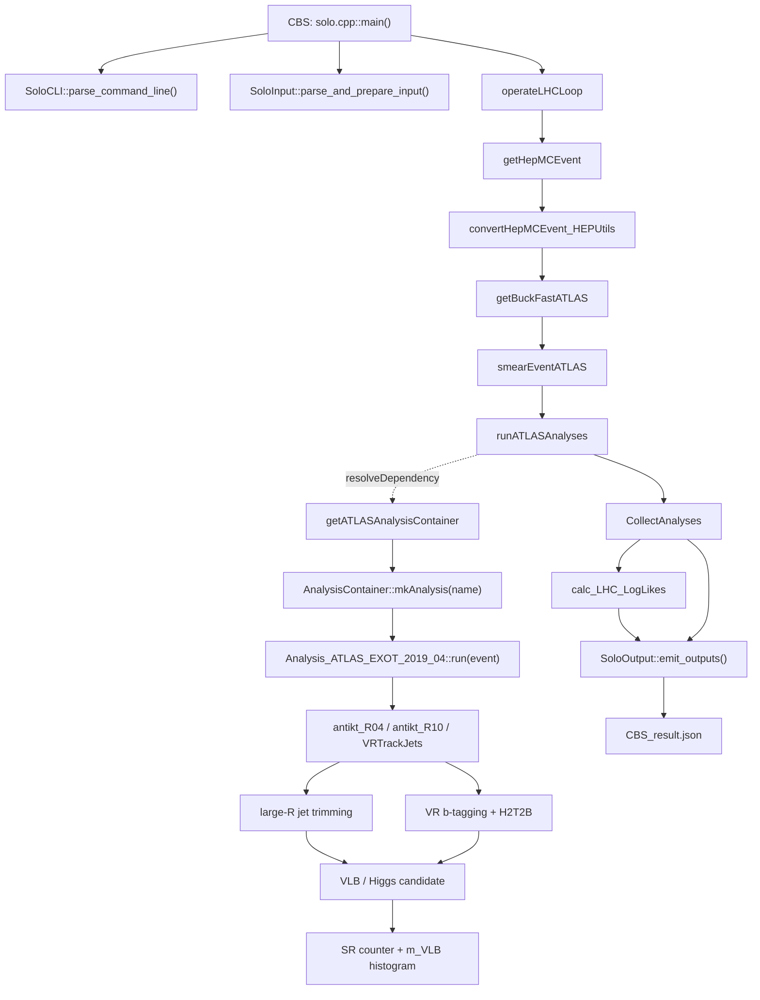

# ColliderBit 调用/依赖关系图 V1

## 范围

这是第一版的源码证据驱动静态图，范围限定为：

`CBS → ATLAS_EXOT_2019_04`

图中的关系来自 `solo.cpp`、`ColliderBit_eventloop.cpp`、`getHepMCEvent.cpp`、`AnalysisContainer.cpp`、`Analysis_ATLAS_EXOT_2019_04.cpp` 和 `solo_output.cpp` 的源码检查。

## 图

## 解释

- 实线表示源码中可直接追踪的调用/数据处理关系。
- 虚线表示 GAMBIT module dependency，通过 `resolveDependency()` 连接，不一定是普通的 C++ 直接调用。
- 分析内部的 `jets → trimming → b-tagging → candidate → SR` 是从 `run()` 内部代码块抽取出的物理语义流程，不代表每一步都有一个独立函数。

## 证据文件

- `ColliderBit/examples/solo.cpp`
- `ColliderBit/src/ColliderBit_eventloop.cpp`
- `ColliderBit/src/getHepMCEvent.cpp`
- `ColliderBit/src/analyses/AnalysisContainer.cpp`
- `ColliderBit/src/analyses/Analysis_ATLAS_EXOT_2019_04.cpp`
- `ColliderBit/examples/solo_output.cpp`
- `runs/CBS_result.json`

## 限制

V1 没有运行 `clang-diff` 或 `clang-uml`，也没有编译或运行 CBS；它是手工整理的静态基线，作为后续工具生成版本的对照。
