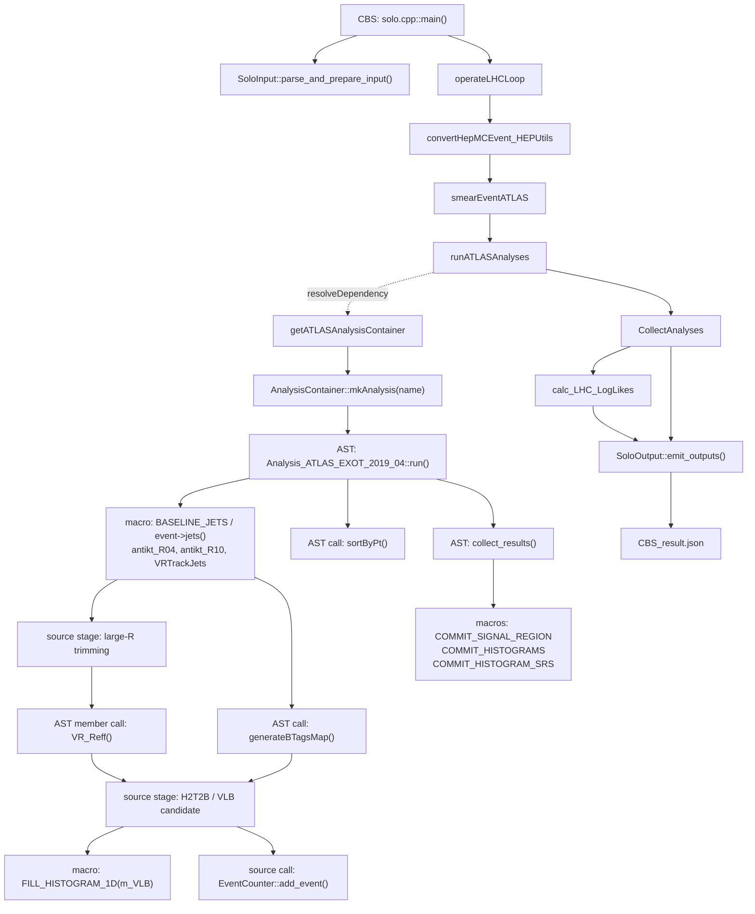

# ColliderBit 调用/依赖关系图 V2（Clang AST-assisted）

## 范围

V2 仍然限定在 `CBS → ATLAS_EXOT_2019_04`，但对分析翻译单元使用 Apple Clang 的 AST dump 做了静态解析。没有修改源码，也没有编译或运行 CBS。

Clang 解析确认了以下成员函数：

- `Analysis_ATLAS_EXOT_2019_04::run`，源文件第 63 行
- `Analysis_ATLAS_EXOT_2019_04::collect_results`，源文件第 316 行
- `Analysis_ATLAS_EXOT_2019_04::analysis_specific_reset`，源文件第 328 行
- `Analysis_ATLAS_EXOT_2019_04::VR_Reff`，源文件第 343 行

在 `run()` 的 AST 中确认了对 `sortByPt` 和 `generateBTagsMap` 的调用。`VR_Reff` 通过成员函数引用出现。`BASELINE_JETS`、`FILL_HISTOGRAM_1D` 和 `COMMIT_*` 是宏，V2 同时保留了它们的源码语义标签。

## 图



## V1 到 V2 的变化

- V1 主要是人工整理的模块级和物理语义级流程。
- V2 对 `Analysis_ATLAS_EXOT_2019_04.cpp` 引入了 Clang AST 证据，区分了成员函数、普通调用、宏展开和源码语义阶段。
- V2 仍然不会自动理解 `resolveDependency()` 背后的运行时调度，也不会证明某条分支在具体事件中实际执行；这些关系需要结合 GAMBIT 源码和已有 JSON 输出解释。

## 工具方法

使用的是 Clang 前端的 syntax-only AST dump，核心形式为：

```text
clang++ -std=c++17 -fsyntax-only -w \
  -Xclang -ast-dump=json \
  -Xclang -ast-dump-filter=Analysis_ATLAS_EXOT_2019_04 \
  -Icmake/include -IColliderBit/include -IElements/include -ICore/include -IUtils/include -ILogs/include -IBackends/include \
  -Icontrib/heputils/include -Icontrib/mkpath/include -Icontrib/mcutils/include -Icontrib/multimin/include -Icontrib/slhaea/include \
  -Icontrib/fastjet-3.4.2/include -Icontrib/fastjet-3.4.2/fastjet-3.4.2/include -Icontrib/fastjet-3.4.2/fastjet-3.4.2/tools \
  -Icontrib/yaml-cpp-0.6.2/include -Icontrib/METSignificance/include -IModels/include -I../sources \
  -I/opt/homebrew/include/eigen3 -I/opt/homebrew/opt/libomp/include -I/opt/homebrew/include \
  ColliderBit/src/analyses/Analysis_ATLAS_EXOT_2019_04.cpp
```

外部依赖路径是手动提供的，因为当前工作区没有找到 `compile_commands.json`。该命令只做预处理、解析和 AST 输出，不生成 CBS object file 或 executable。

## 限制

- V2 不是完整 ColliderBit 全工程调用图。
- 宏、模板和 GAMBIT module functor 仍需要语义标注。
- 当前版本没有使用 runtime instrumentation，因此不能给出真实事件级执行路径。
